# Frontend Architectures Overview

## 1. Component-Based Architecture

- **Why**: Promotes modularity, reusability, and maintainability.
- **When**: Best for modern web apps of any scale, from small SPAs to enterprise platforms.
- **How**: UI is split into independent, reusable components (buttons, forms, dashboards), each managing its own state and rendering logic.
- **Resolves**: Code duplication, tangled dependencies, difficulty scaling large apps.
- **Frameworks/Libraries**: React, Angular, Vue, Svelte.
- **Diagram**: 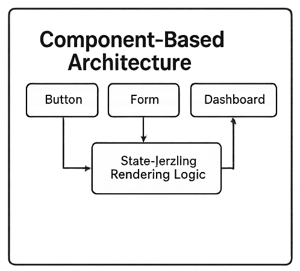

## 2. MVC (Model-View-Controller)

- **Why**: Clear separation of concerns between data (Model), UI (View), and logic (Controller).
- **When**: Traditional web apps, especially server-rendered or hybrid apps.
- **How**: Controller handles input, updates the Model, and refreshes the View.
- **Resolves**: Spaghetti code in early web apps, improves testability and structure.
- **Frameworks/Libraries**: AngularJS (classic), Backbone.js, Ember.js.
- **Diagram**: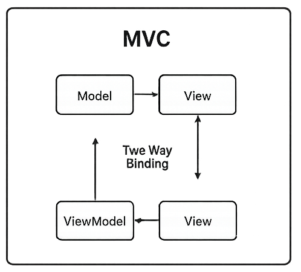

## 3. MVVM (Model-View-ViewModel)

- **Why**: Improves on MVC by binding UI directly to a ViewModel, reducing boilerplate.
- **When**: Apps with heavy UI interaction and dynamic state.
- **How**: ViewModel acts as an abstraction of the View, syncing data automatically.
- **Resolves**: Manual DOM manipulation, complex state synchronization.
- **Frameworks/Libraries**: Angular (modern), Knockout.js, Vue.
- **Diagram**: 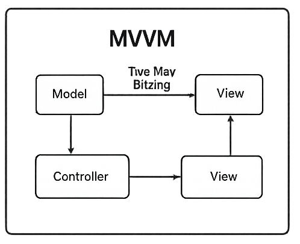

## 4. Flux / Redux (Unidirectional Data Flow)

- **Why**: Predictable state management with a single source of truth.
- **When**: Large-scale apps with complex state interactions.
- **How**: Actions → Dispatcher → Store → View. State flows in one direction only.
- **Resolves**: State inconsistency, debugging complexity, unpredictable UI behavior.
- **Frameworks/Libraries**: Redux, NgRx (Angular), MobX, Recoil.
- **Diagram**: 

## 5. Micro-Frontends

- **Why**: Enables independent teams to build and deploy features separately.
- **When**: Enterprise-scale apps with multiple teams and domains.
- **How**: App is split into smaller frontend apps, integrated at runtime.
- **Resolves**: Monolithic frontend bottlenecks, scaling across teams.
- **Frameworks/Libraries**: Module Federation (Webpack 5), Single-SPA, Luigi.
- **Diagram**: 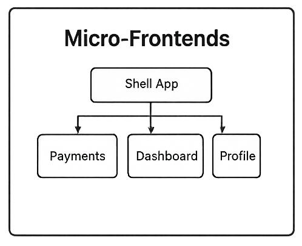

## 6. JAMstack (JavaScript, APIs, Markup)

- **Why**: Fast, secure, CDN-friendly static sites with dynamic capabilities via APIs.
- **When**: Blogs, e-commerce sites, marketing pages, or apps with mostly static content.
- **How**: Pre-rendered static files served via CDN, dynamic features via APIs.
- **Resolves**: Performance bottlenecks, server costs, security risks.
- **Frameworks/Libraries**: Next.js, Gatsby, Nuxt.js, Hugo.
- **Diagram**: 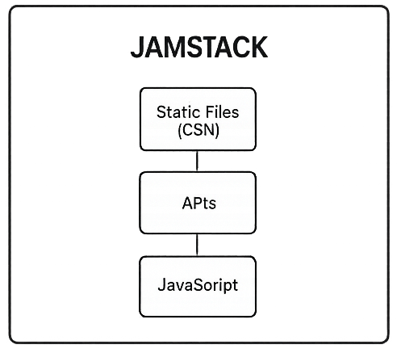

## 7. Server-Side Rendering (SSR) / Universal Apps

- **Why**: Improves SEO and initial load performance.
- **When**: Content-heavy apps needing fast first paint and SEO optimization.
- **How**: Server renders HTML before sending to client, then hydrates with JS.
- **Resolves**: Poor SEO of SPAs, slow initial load.
- **Frameworks/Libraries**: Next.js (React), Nuxt.js (Vue), Angular Universal.
- **Diagram**: 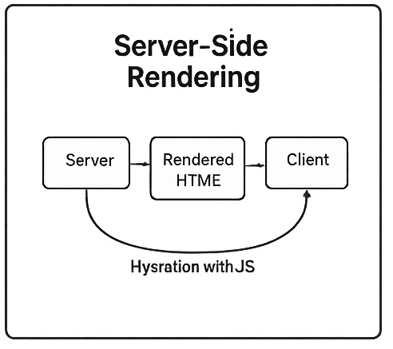

## 8. Progressive Web Apps (PWA)

- **Why**: Deliver app-like experiences directly in the browser.
- **When**: Apps needing offline support, push notifications, and mobile-like UX.
- **How**: Service workers cache assets, manifest enables installability.
- **Resolves**: Native app dependency, poor offline experience.
- **Frameworks/Libraries**: Angular PWA, Workbox, React PWA templates.
- **Diagram**: 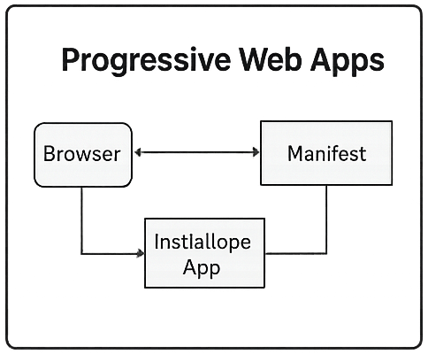

---

# Comparison Matrix

| Architecture         | Pros                                                      | Cons                                                              | Complexity | Scalability |
| -------------------- | --------------------------------------------------------- | ----------------------------------------------------------------- | ---------- | ----------- |
| Component-Based      | Modular, reusable, maintainable, strong ecosystem         | Can lead to over-engineering, requires state management solutions | Medium     | High        |
| MVC                  | Clear separation of concerns, structured                  | Verbose, outdated for modern SPAs                                 | Low-Medium | Medium      |
| MVVM                 | Automatic data binding, reduces boilerplate               | Harder debugging, risk of hidden complexity                       | Medium     | Medium-High |
| Flux/Redux           | Predictable state, easy debugging, single source of truth | Boilerplate-heavy, steep learning curve                           | High       | High        |
| Micro-Frontends      | Independent deployments, team autonomy                    | Complex integration, requires strong DevOps                       | High       | Very High   |
| JAMstack             | Fast, secure, CDN-friendly, cost-effective                | Limited dynamic features, API dependency                          | Low-Medium | Medium      |
| SSR / Universal Apps | SEO-friendly, fast initial load                           | Server cost, complexity in hydration                              | Medium     | High        |
| Progressive Web Apps | Offline support, app-like UX, installable                 | Limited iOS support, requires service worker expertise            | Medium     | Medium-High |

---

## Micro-Frontends Architecture: Deep Dive

Micro-frontends architecture breaks a frontend monolith into independently developed, deployed, and maintained UI fragments. It mirrors microservices on the frontend, enabling team autonomy, scalability, and tech diversity.

---

### 🧱 What Is Micro-Frontends Architecture?

Micro-frontends divide a web app into **feature-based fragments** (e.g., Dashboard, Profile, Payments), each owned by a separate team. These fragments are integrated into a **shell or host app** that orchestrates routing, layout, and shared state.

- **Goal**: Decouple frontend development across teams.
- **Benefits**: Independent deployability, tech stack flexibility, faster iteration, and better fault isolation.
- **Challenges**: Shared state, consistent UX, performance overhead, and integration complexity.

---

### 🕰️ Old Approaches

#### 1. iframes

- **How**: Embed isolated apps via `<iframe>` tags.
- **Pros**: Full isolation, easy integration.
- **Cons**: Poor UX, limited communication, performance issues.
- **Used with**: Vanilla JS, jQuery, legacy stacks.
- **Diagram**: 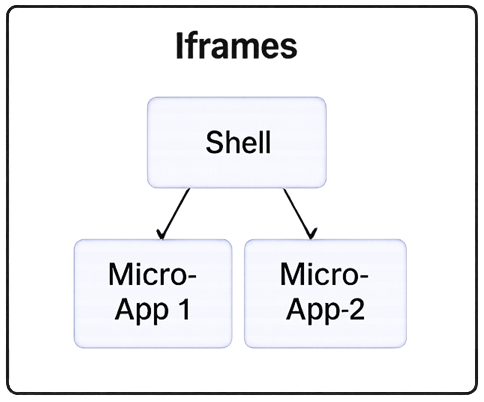

#### 2. Build-time Composition

- **How**: Use tools like Webpack to bundle micro-apps into a single build.
- **Pros**: Simple setup, shared dependencies.
- **Cons**: Tight coupling, no independent deployment.
- **Used with**: Angular CLI, Create React App, Vue CLI.
- **Diagram**: 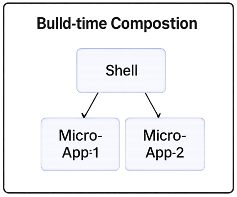

---

### 🚀 Modern Approaches

#### 1. Webpack Module Federation

- **How**: Dynamically load remote modules at runtime.
- **Pros**: True runtime composition, independent deployment, shared libraries.
- **Cons**: Requires careful versioning and orchestration.
- **Used with**: React, Angular, Vue, Svelte, Nx monorepos.
- **Diagram**: 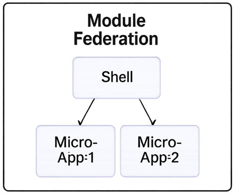

#### 2. Single-SPA

- **How**: Framework-agnostic runtime orchestrator for multiple micro-apps.
- **Pros**: Supports multiple frameworks, lifecycle hooks, routing.
- **Cons**: Steeper learning curve, manual setup.
- **Used with**: React + Angular hybrid, legacy migration paths.
- **Diagram**: 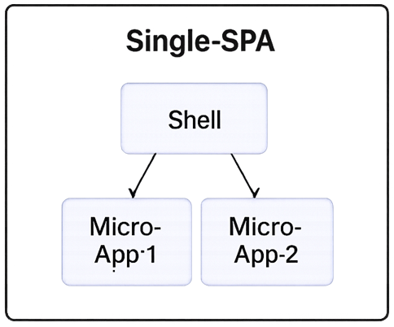

#### 3. Web Components

- **How**: Use native browser APIs (`customElements`, Shadow DOM) to encapsulate UI.
- **Pros**: Framework-agnostic, reusable, isolated styles.
- **Cons**: Limited state management, browser support quirks.
- **Used with**: Lit, Stencil, vanilla JS.
- **Diagram**: 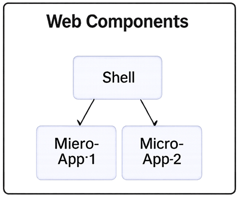

#### 4. Nx + Module Federation

- **How**: Nx monorepo with dynamic federation and shared libraries.
- **Pros**: Dev ergonomics, CI/CD integration, scalable workspace.
- **Cons**: Requires Nx expertise.
- **Used with**: Angular, React, Next.js.
- **Diagram**: 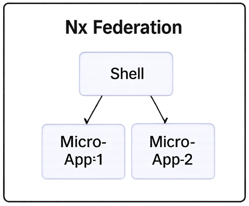

---

### 🧩 Integration Strategies

| Strategy               | Description                                       | Best For                                   |
| ---------------------- | ------------------------------------------------- | ------------------------------------------ |
| Runtime Composition    | Load micro-apps dynamically via federation or SPA | Large-scale apps with frequent deployments |
| Build-Time Composition | Bundle all micro-apps together during CI          | Smaller teams or legacy migration          |
| Web Components         | Use native encapsulation for UI fragments         | Cross-framework reuse, design systems      |

---

## Handling Large Datasets in Angular Applications

Working with large datasets in Angular requires combining smart rendering strategies, efficient data management, and browser-friendly techniques. The goal is to ensure smooth performance even with tens of thousands of rows or complex grids.

---

### 🧠 Key Strategies

#### 1. Use OnPush Change Detection
- Switch components to `ChangeDetectionStrategy.OnPush` to avoid unnecessary re-renders.
- Angular only checks for changes when inputs change, improving performance.

---

#### 2. Implement Virtual Scrolling
- Render only visible rows using Angular CDK’s `cdk-virtual-scroll-viewport`.
- Reduces DOM load drastically.
- Ideal for tables, lists, and grids.
```html
<cdk-virtual-scroll-viewport itemSize="50" class="viewport">
  <div *cdkVirtualFor="let item of items; trackBy: trackById">
    {{ item.name }}
  </div>
</cdk-virtual-scroll-viewport>
```
```typescript
trackById(index: number, item: DataItem): number {
  return item.id;
}
```
---

#### 3. Paginate the Data
- Load and display data in chunks (e.g., 50–100 rows per page).
- Combine with server-side pagination for massive datasets.
- Use Angular Material Table with pagination controls.

---

#### 4. Lazy Load Modules and Routes
- Split the app into feature modules and load them only when needed.
- Reduces initial bundle size and speeds up load time.

---

#### 5. Use IndexedDB for Local Storage
- Store large datasets locally using IndexedDB (via Dexie.js).
- Enables offline access and fast querying without memory overload.
- Avoid using `localStorage` or `NgRx` for very large datasets.

---

#### 6. Optimize Rendering with trackBy
- Use `*ngFor="let item of items; trackBy: trackByFn"` to prevent Angular from re-rendering unchanged items.
- Essential for dynamic lists.

---

#### 7. Debounce and Throttle User Input
- Prevent excessive filtering or sorting operations by debouncing search inputs.
- Use RxJS operators like `debounceTime()` and `distinctUntilChanged()`.

```typescript
this.searchControl.valueChanges
  .pipe(
    debounceTime(300),
    distinctUntilChanged()
  )
  .subscribe(query => this.filterData(query));
```
---

#### 8. Offload Heavy Processing to Web Workers
- Move CPU-intensive tasks (e.g., parsing, filtering) to background threads.
- Keeps UI responsive.

---

### 🧠 Summary

Modern micro-frontends are powered by **Webpack Module Federation**, **Single-SPA**, and **Nx**, offering runtime flexibility and independent deployment. Older methods like iframes and build-time bundling laid the groundwork but lacked scalability. Today’s tools allow **true decoupling**, enabling teams to ship faster without stepping on each other’s toes.
